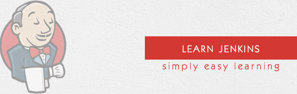

# Guiding questions to keep in mind while learning

## What is Jenkins?
- Jenkins is a powerful application that allows continuous integration and continuous delivery of projects, regardless of the platform you are working on. It is a free source that can handle any kind of build or continuous integration. You can integrate Jenkins with a number of testing and deployment technologies. In this tutorial, we would explain how you can use Jenkins to build and test your software projects continuously.

## How useful is it for me?
- This tutorial is going to help all those software testers who would like to learn how to build and test their projects continuously in order to help the developers to integrate the changes to the project as quickly as possible and obtain fresh builds.
- Jenkins is a popular tool for performing continuous integration of software projects. This is a preliminary tutorial that covers the most fundamental concepts of Jenkins. Any software professional having a good understanding of Software Development Life Cycle should benefit from this tutorial.

## Is it free for use?
* Yes, open source.
* Automation server.
* It supports version control tools, including AccuRev, CVS, Subversion, Git, Mercurial, Perforce, TD/OMS, ClearCase and RTC, and can execute Apache Ant, Apache Maven and sbt based projects as well as arbitrary shell scripts and Windows batch commands. 

