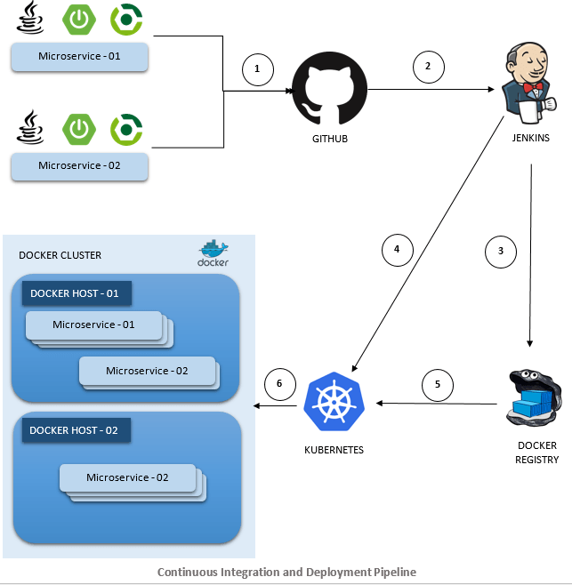
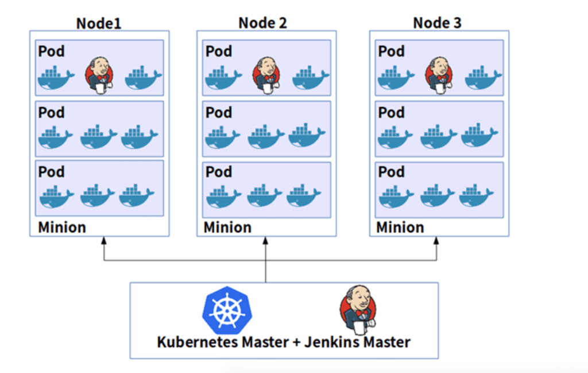

# Overview of what is needed for Devops

## Technologies required for **Microservices**
* Github (Code hosting service)
* Jenkins (webhooks and automation)
* Docker (Images and server)
* Kubernetes (Deployment and management of containers)

## Overview of tech stack:
- 

## Overview of architecture
- 