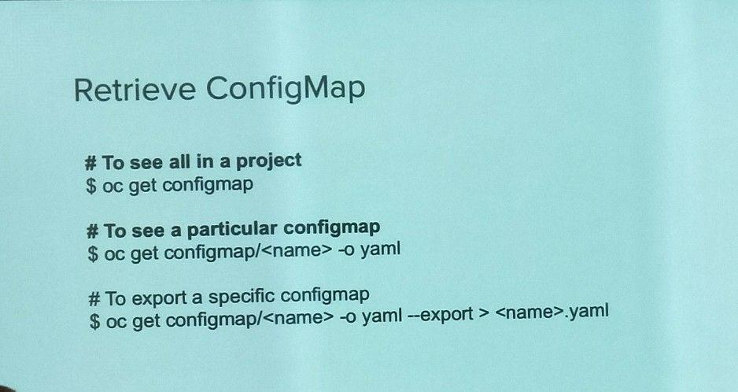
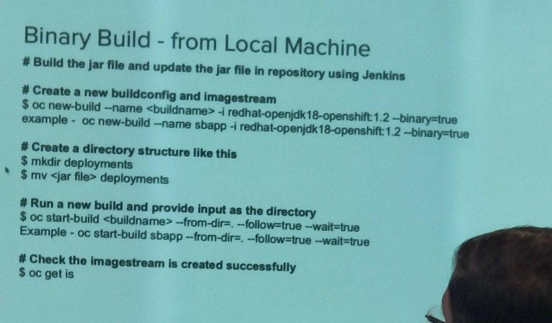

# Developer's guide to OCP

## Recap
- Containers
    - Container image is a binary
    - Container is an execution of a container image
- Image Repository
    - Contains all versions of an image in the image registry
    - Can contain multiple endpoints:
        - eg. registry/frontend
            - frontend:latest
            - frontend:2.0
        - eg. registry/mongo
            - mongo:latest
            - mongo:2.1
- Pods
    - Pods are contained within openshift
    - Containers are wrapped in pods which are units of deployment and management
    - **Practically**, all applications should be deployed in a manner of 1 container within 1 pod. This helps to prevent dependency since the pod would die upon the death of any applications within the containers currently in it.
- Backend service integration with pods
    - **Backend service** acts as the router and load balancer
    - Uses *Selectors* to select which pods to route traffic to using key:value pairs.
    - These **"service objects"** need to be defined such that the labels are clear (key:value pairing such as "role:backend")
    - Therefore, **labelling** via key-value is a powerful concept in openshift

## How to create configmap for openshift pods
- All are in YAML files
    - This will be converted to objects later
- `oc create configmap -h`
- Create new configmap
    - `oc create configmap my-config --from-file=key1=/path/to/bar/file1.txt`
    - 
- Retrieve Configmap
    - 
- Create secret
    - For creation and storage of sensitive data
    - 
- Retrieve secrets
    - For retrieving files
    - 

## Imagestreams
- Point to imagestream object instead of image direct
- imagestream object points to image
- Able to set up triggers whenever new image is being pointed to
    - In the form of deployments
- Able to either point to a specific version, or latest.
- Architecture for imagestream:
    - Acts as a middle layer between the pod and the (image) registry 
- **Describe imagestream**
    - `oc describe is/python -n openshift`
- **Describe imagestreamtag**
    - `oc describe istag/python:3.5 -n openshift`
- **Binary build example**
    - 

## Upgrading
- Having multiple pods with different versions of the same application allows for upgrades:
    - *"Rolling upgrade"*: increment single version at a time
    - *"Blue Green"*: have 2 similar pods at the same time
        - Green and Blue are similar environments/versions, which allow for rollback or switching if either of the pods are down at any time
            - Each of the environments will have to go through a rolling upgrade since generally don't want both to exist in the same version at the same time
            - Therefore, take turns alternating the upgrades between the versions

## About Docker
- Important to note that docker is separate

# Questions
- *service-mesh*??
- *what is pivotal?*
    - pivotal platform is a service:
        - unified, multi-cloud platform